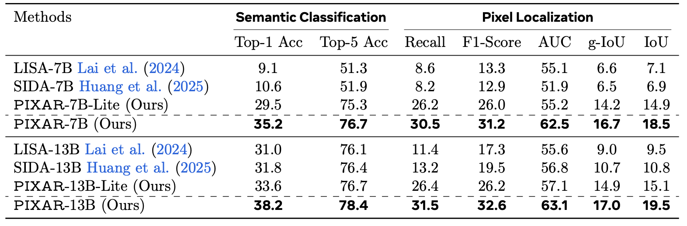

<div align="center">

<h3>&ensp;<em>From Masks to Pixels and Meaning:<br>A New Taxonomy, Benchmark, and Metrics for VLM Image Tampering</em></h3>

<p>
  <a href=""></a>
  &nbsp;
  
  &nbsp;
  
  &nbsp;
  
</p>

<p>
<strong>Xinyi Shang</strong>*&ensp;
<strong>Yi Tang</strong>*&ensp;
<strong>Jiacheng Cui</strong>*&ensp;
<strong>Ahmed Elhagry</strong>&ensp;
<strong>Salwa K. Al Khatib</strong><br>
<strong>Sondos Mahmoud Bsharat</strong>&ensp;
<strong>Jiacheng Liu</strong>&ensp;
<strong>Xiaohan Zhao</strong>&ensp;
<strong>Jing-Hao Xue</strong>&ensp;
<strong>Hao Li</strong>&ensp;
<strong>Salman Khan</strong>&ensp;
<strong>Zhiqiang Shen</strong>†
</p>

<p><sub>* Equal contribution &nbsp;|&nbsp; † Corresponding author &nbsp;|&nbsp; Preprint</sub></p>

<br>


<p><sub><em>Mask-based labels misalign with true edit signals (top). Our pixel-difference labels are precisely aligned with the generative footprint (bottom).</em></sub></p>

<br>

> **TL;DR**: We expose a fundamental flaw in mask-based tampering benchmarks, and introduce **PIXAR**: a 420K+ benchmark with pixel-faithful labels, 8 manipulation types, and a VLM detector that simultaneously localizes, classifies, and describes tampered regions, achieving **2.7× IoU improvement** over prior SOTA.

</div>

---

## 🔥 News
- **[2026-03]** 📦 Code and model weights and PIXAR benchmark (420K+ pairs) are released.
- **[2026-02]** 🎉 Paper accepted to **CVPR 2026 Findings** (withdrawn for resubmission).
---

## Overview

Existing tampering benchmarks rely on coarse object masks as ground truth, which severely misalign with the true edit signal: many pixels inside a mask are untouched, while subtle yet consequential edits outside the mask are treated as natural. We reformulate VLM image tampering from coarse region labels to a **pixel-grounded, meaning- and language-aware** task.

**PIXAR** is a large-scale benchmark and training framework with three core contributions:

1. **A new taxonomy** spanning 8 edit primitives (replace / remove / splice / inpaint / attribute / colorization, etc.) linked to the semantic class of the tampered object.
2. **A new benchmark** of over 420K training image pairs and a carefully balanced 40K test set, each with per-pixel tamper maps, semantic category labels, and natural language descriptions.
3. **A new training framework and metrics** that quantify pixel-level correctness with localization, assess confidence on true edit intensity, and measure tamper meaning understanding via semantics-aware classification and natural language descriptions.

---

## Motivation

<div align="center">

<p><em><b>Pitfalls of current benchmarks.</b> Mask-based labels contain large misaligned regions. Our pixel-difference label is precisely aligned with the true generative pixels.</em></p>
</div>

Existing benchmarks use coarse object masks as ground truth, conflating unedited pixels inside the mask with tamper evidence while ignoring real edits outside it. We replace masks with a per-pixel difference map **D** = |I_orig − I_gen|, thresholded at a tunable τ to obtain **M**_τ — capturing micro-edits at small τ and high-confidence semantic changes at large τ.

<div align="center">

<p><em>Pixel-level labels under different τ.</em></p>
</div>

---

## PIXAR Benchmark

| Split | Size | Labels |
|---|---|---|
| Training | 420K+ image pairs | Pixel-level M_τ, semantic class, text description |
| Test | 40K image pairs (balanced) | Pixel-level M_τ, semantic class, text description |

8 tampering types (replacement, removal, addition, material/color/attribute change, splice, inpaint) generated by Flux.2, Gemini 2.5/3, GPT-image-1.5, Qwen-Image, Seedream 4.5. Each entry includes the raw per-pixel difference map so labels can be re-derived at any τ. A four-stage pipeline (generation → effectiveness checks → fidelity assessment by Qwen3 + human review → label construction) ensures high quality.

| Dataset | Year | Multi-Object | Fidelity Check | Ground Truth |
|---|---|---|---|---|
| SIDBench / M3Dsynth / SemiTruths / SID-Set | 2024–25 | ✗ | ✗ | Mask |
| **PIXAR (Ours)** | **2026** | **✓** | **✓** | **Pixel & Semantics** |

---

## Method

<div align="center">

<p><em><b>PIXAR training framework.</b> The model jointly trains a CLS head for image-level detection, an OBJ head for semantic classification, a SEG head for pixel-level localization, and a text decoder for tamper description generation.</em></p>
</div>

The PIXAR detector fθ takes an image and a user prompt, and simultaneously produces:
- **(i)** a per-pixel tamper logit map **S** ∈ ℝ^(H×W) → predicted mask **M̂**
- **(ii)** a multi-label semantic logit vector **z** ∈ ℝ^|C| → object category predictions **ŷ**
- **(iii)** a natural language description of the specific tampering artifact

### Architecture

Built on LLaVA + LLaMA-2 with LoRA fine-tuning, integrated with SAM ViT-H for pixel-level decoding and CLIP ViT-L/14 for visual-language alignment.

Three special tokens anchor the multi-task heads in the token sequence:

| Token | Role |
|---|---|
| `[CLS]` | Hidden state → 3-way classification (real / tampered) via `FC_cls` |
| `[OBJ]` | Hidden state → multi-label object recognition (81 COCO classes) via `FC_obj` |
| `[SEG]` | Hidden state fused with generated text → SAM prompt for pixel localization via `FC_seg` |

### Training Objective

```
L_total = λ_sem · L_sem  +  λ_bce · L_bce  +  λ_dice · L_dice  +  λ_text · L_text  +  λ_cls · L_cls
```

Default weights: λ_sem = 0.1, λ_dice = 1.0, λ_text = 2.0.

### Segmentation Prompt Modes

The `[SEG]` token embedding can be fused with the generated text description in three ablation modes:

| Mode | Fused prompt |
|---|---|
| `seg_only` | seg_emb only |
| `text_only` | text_emb only |
| `fuse` | gate · seg_emb + (1 − gate) · text_emb, gate = σ(MLP([seg_emb, text_emb])) |

---

## Results

<div align="center">

</div>

> PIXAR-7B achieves a near-doubling of localization accuracy over SIDA-7B (IoU 6.9 → 18.5). PIXAR-13B further sets new SOTA across all metrics.

## Project Structure

```
PIXAR/
├── assets/                          # Paper figures and PDF
│   ├── method.png
│   ├── motivation.png
│   ├── vis_tau_1.png
│   └── exp.png
├── model/
│   ├── PIXAR.py                     # Core model: PIXARForCausalLM
│   ├── llava/                       # LLaVA backbone
│   └── segment_anything/            # SAM encoder
├── finetune/
│   ├── finetune_PIXAR-7B_*.sh       # Training scripts 
├── evaluation/
│   ├── evaluation_PIXAR-7B_*.sh     # Evaluation scripts
│   ├── text_eval/
│   │   └── compute_css.py           # Cosine Semantic Similarity scoring
│   └── README.md                    # Evaluation guide
├── utils/
│   ├── PIXAR_Set.py                 # Dataset class (CustomDataset)
│   ├── utils.py                     # AverageMeter, IoU computation
│   └── batch_sampler.py             # Custom distributed batch sampler
├── utils_preprocess/                # Dataset construction scripts
├── download-data/                   # Data download scripts
│   ├── download.sh
│   ├── files.txt
│   └── README.md
├── train_PIXAR.py                   # Main training script
├── test_parallel.py                 # Multi-GPU parallel evaluation
├── chat.py                          # Interactive inference
├── merge_lora_weights_and_save_hf_model.py
├── merge.sh
├── visualization.py
└── filter.py
```

---

## Environment Setup

### 1. Install Dependencies

```bash
pip install -r requirements.txt
```

Python 3.10

### 2. Fix Environment

```bash
bash fix/fix.sh
```

if it is not working, please run fix_again.sh

### 3. Pretrained Weights

| Component | Description |
|---|---|
| PIXAR-7B base model | HuggingFace-format LLaVA-LLaMA-2 base |
| SAM ViT-H | `sam_vit_h_4b8939.pth` |
| CLIP ViT-L/14 | `openai/clip-vit-large-patch14` (auto-downloaded) |

### 4. Download Data

---

## Data

We provide two ways to obtain the PIXAR dataset:

**Option A — Download preprocessed data (recommended).** Training and test sets preprocessed at τ = 0.05 are available on [Google Drive](https://drive.google.com/drive/folders/1BVGynhPqKCRJDtbJKmMQZFdHFtZ2qUj8?usp=sharing).

**Option B — Build from raw data with a custom τ.** For users who wish to construct labels at a different threshold, we release the raw image pairs alongside the pixel-difference maps, allowing labels to be re-derived at any τ. See [Custom Dataset Processing](#custom-dataset-processing) for details.


### Dataset Format

```
dataset_dir/
├── train/
│   ├── real/               # Authentic images
│   ├── full_synthetic/     # AI-generated images
│   ├── tampered/           # Tampered images
│   ├── masks/              # Hard binary masks
│   ├── soft_masks/         # Pixel-difference maps M_τ (default τ = 0.05)
│   └── metadata/           # JSON per tampered image: {"cls": [...], "text": "..."}
└── validation/
    └── (same structure)
```

---

## Custom Dataset Processing

If you want to build the dataset from scratch at a different τ (e.g., τ = 0.1 to focus on high-confidence edits, or τ = 0.01 for micro-edits), follow these two steps.

### Step 1 — Download raw data

Follow [`download-data/README.md`](./download-data/README.md) to configure rclone, populate `download-data/files.txt` with the raw zip filenames from Google Drive, and run:

```bash
bash download-data/download.sh
```

This downloads and extracts raw image pairs into `DOWNLOAD_DIR`.

### Step 2 — Build dataset at your preferred τ

Open `utils_preprocess/construct_dataset/generate_v2.sh` (mask-only supervision) or `generate_v2-text.sh` (with text descriptions) and edit the config block at the top:

```bash
DATASET_DIR="/path/to/raw_outputs"   # output of download.sh
OUT_DIR="/path/to/output_dataset"    # where to write the processed dataset
TAOS=(0.05)                          # change to e.g. (0.01) (0.1) (0.2) or multiple values
```

Then run:

```bash
cd utils_preprocess/construct_dataset

# Mask-only labels (no text descriptions)
bash generate_v2.sh

# Labels + text descriptions (requires descriptions.csv)
bash generate_v2-text.sh
```

The script calls `2_construct_dataset.py` / `2_construct_dataset_text.py` for each data split and τ value, logging results under `utils_preprocess/construct_dataset/logs/`.

**τ selection guide:**

| τ | Effect |
|---|---|
| 0.01 | Captures micro-edits and subtle pixel changes |
| 0.05 | Default — balanced sensitivity (recommended) |
| 0.1 | High-confidence semantic changes only |
| 0.2 | Conservative — only large, obvious edits |

---

## Training

```bash
deepspeed --include localhost:0 --master_port=12345 train_PIXAR.py \
  --version <path_to_base_model> \
  --dataset_dir <path_to_dataset> \
  --vision_pretrained <path_to_sam_vit_h.pth> \
  --val_dataset <path_to_validation_set> \
  --batch_size 2 --epochs 10 --steps_per_epoch 1000 \
  --lr 1e-4 --dice_loss_weight 1.0 --seg_prompt_mode fuse \
  --precision bf16 --exp_name "pixar_experiment" --log_base_dir ./runs
```

Or use the provided scripts, e.g. `bash finetune/finetune_PIXAR-7B_ours_fuse.sh`. Key hyperparameters: LoRA rank 8, λ_dice = 1.0, λ_sem = 0.1, λ_text = 2.0, τ = 0.05.

After training, merge LoRA weights: `bash merge.sh`

---

## Evaluation

See [`evaluation/README.md`](./evaluation/README.md) for the full guide.

```bash
# Multi-GPU parallel evaluation
python test_parallel.py \
  --version <merged_model> --dataset_dir <test_data> \
  --vision_pretrained <sam.pth> --gpus 0,1,2,3 \
  --output_dir ./evaluation/logs/my_exp \
  --seg_prompt_mode fuse --precision bf16 --save_generated_text

# Text quality (CSS score, requires --save_generated_text above)
cd evaluation/text_eval
python compute_css.py \
  --json_path ../logs/my_exp/generated_texts.json \
  --output_path ./logs/my_exp/css_scores.json
```

---

## Interactive Inference

```bash
python chat.py --version <merged_model> --precision bf16 --seg_prompt_mode fuse
```

---

## Citation

If you find this work useful, please cite:

```bibtex
@inproceedings{shang2026pixar,
  title     = {From Masks to Pixels and Meaning: A New Taxonomy, Benchmark, and Metrics for VLM Image Tampering},
  author    = {Shang, Xinyi and Tang, Yi and Cui, Jiacheng and Elhagry, Ahmed and Al Khatib, Salwa K. and Bsharat, Sondos Mahmoud and Liu, Jiacheng and Zhao, Xiaohan and Xue, Jing-Hao and Li, Hao and Khan, Salman and Shen, Zhiqiang},
  booktitle = {European Conference on Computer Vision (ECCV)},
  year      = {2026}
}
```
